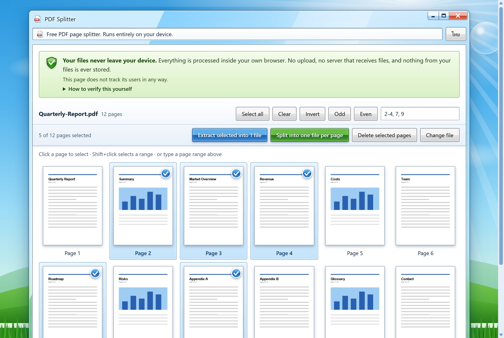
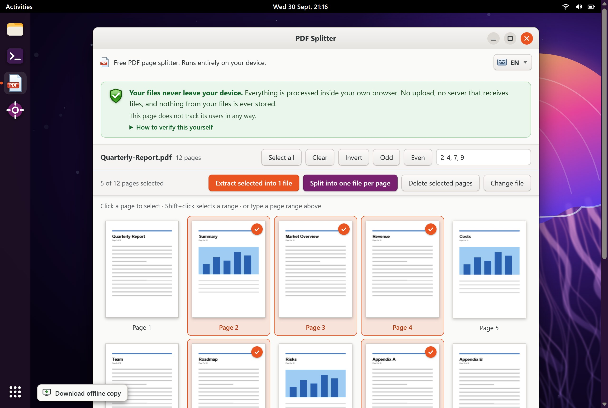
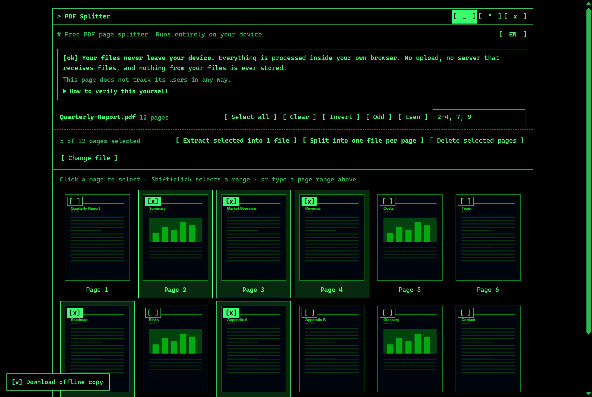

<div align="center">

# PDF Splitter

**Cut pages out of a PDF in seconds. Your file never leaves your device.**

ตัดหน้า PDF ฟรี ทำงานในเบราว์เซอร์ของคุณทั้งหมด ไฟล์ไม่ถูกอัปโหลดไปไหน

[](https://github.com/AlungranPJ/pdf-splitter/actions/workflows/pages.yml)
[](LICENSE)


### [Open the app](https://alungranpj.github.io/pdf-splitter/) &nbsp;·&nbsp; [อ่านภาษาไทย](README.th.md)

<br>



</div>

<br>

## Why this exists

Most "free PDF tools" upload your file to a server. That is fine for a menu, and not fine for a contract, a payslip or a medical form.

PDF Splitter does the whole job inside your browser tab. There is no upload step because there is no server that could receive one, and the page ships a Content-Security-Policy that makes the browser itself refuse outbound connections.

## Features

| Feature | What it does |
|---|---|
| **Pick pages visually** | Click thumbnails, `Shift`+click for a range, or type `1-3, 5, 8-10`. |
| **Three outputs** | Extract the selection into **one file**, split into **one file per page**, or **delete** the selected pages. |
| **Quick selectors** | Select all, clear, invert, odd pages, even pages. |
| **Thai and English** | Auto-detected from the browser, one-click toggle, or force it with `?lang=th` / `?lang=en`. |
| **Offline copy** | The **Download offline copy** button (bottom-left) gives you one self-contained HTML file with no visit counter and every network connection blocked. Keep it on your desktop and use it with the internet off. |
| **Three looks** | Windows 7 Frutiger Aero by default. The window's minimize button switches to a green-on-black terminal (TUI) look, the maximize button to an Ubuntu 22.04 "Jammy Jellyfish" desktop. Press it again to go back. Same features in all three. |
| **Keyboard friendly** | Thumbnails are focusable checkboxes: `Tab` to move, `Space` or `Enter` to toggle. |
| **Responsive** | Desktop and phone layouts. |

## Screenshots

<table>
  <tr>
    <td width="50%"></td>
    <td width="50%"></td>
  </tr>
  <tr>
    <td align="center"><sub>Start screen: drop a PDF or choose a file</sub></td>
    <td align="center"><sub>Thai interface (auto-detected)</sub></td>
  </tr>
  <tr>
    <td width="50%"></td>
    <td width="50%"></td>
  </tr>
  <tr>
    <td align="center"><sub>Maximize button: Ubuntu 22.04 look</sub></td>
    <td align="center"><sub>Minimize button: terminal (TUI) look</sub></td>
  </tr>
  <tr>
    <td width="50%"></td>
    <td width="50%" align="center"></td>
  </tr>
  <tr>
    <td align="center"><sub>Privacy notice with "How to verify this yourself"</sub></td>
    <td align="center"><sub>Phone layout (390 px wide)</sub></td>
  </tr>
</table>

> Screenshots were taken from a local build without the visit counter, using a synthetic sample PDF. The hosted site additionally shows the counter sentence described under [Privacy](#privacy). The Ubuntu wallpaper is an original drawing in the spirit of the Jammy Jellyfish artwork, not a copy of it.

## How to use

1. Open **https://alungranpj.github.io/pdf-splitter/**.
2. Drop a PDF on the page, or press **Choose PDF file**.
3. Select pages by clicking thumbnails, or type a range such as `2-4, 7, 9`.
4. Press one of the three actions. The result downloads straight from your browser.

### Use it offline (no data can leave)

Press **Download offline copy** at the bottom-left of the page and save `pdf-splitter-offline.html`. Open it by double-clicking. It is built without the visit counter and with `connect-src 'none'`, so the browser itself refuses every outgoing connection, even if you are online. To check, open DevTools → Network while you use it: nothing is requested.

Downloaded file names:

| Action | File name |
|---|---|
| Extract selected into 1 file | `<name>_p2-4_7_9.pdf` |
| Split into one file per page | `<name>_page001.pdf`, `<name>_page002.pdf`, … |
| Delete selected pages | `<name>_removed.pdf` |

## Privacy

- PDFs are read and written **only in your browser**, using [pdf-lib](https://github.com/Hopding/pdf-lib) and [PDF.js](https://github.com/mozilla/pdf.js), both bundled into the page. There is no upload and no server that receives files.
- A strict `Content-Security-Policy` is set in the page: `default-src 'none'`, no remote fonts, images or scripts. The browser blocks any attempt to send data anywhere it is not allowed to.
- **Visit counter.** The hosted site counts page visits anonymously with [GoatCounter](https://www.goatcounter.com/). It uses no cookies, is never given file names or file contents, and does nothing if your browser sends Do Not Track. This is the only network call the page makes, the CSP allows exactly that one host and nothing else, and the privacy notice on the page says so. A build without a counter contains no tracking code at all (see below). The **offline copy never contains the counter**, and `build.py` refuses to write it if any counter code slipped in.

**Verify it yourself**

1. Open DevTools (`F12`) → **Network**, split a file, and check that no request carries your data.
2. View source and read the CSP `<meta>` tag.
3. Save the page as `.html`, go offline, and use it. It still works.

## Build from source

`build.py` generates the single self-contained pages (plus `th/`, `en/`, `sitemap.xml`, `robots.txt`) from `template.html` and the libraries in `vendor/`: `index.html` (the hosted page) and `pdf-splitter-offline.html` (what the download button hands out). You need Python 3 and nothing else.

```bash
git clone https://github.com/AlungranPJ/pdf-splitter.git
cd pdf-splitter

python build.py                       # no tracking code in either file
python build.py --goatcounter mysite  # visit counter in index.html only, via mysite.goatcounter.com

# then just open index.html (or pdf-splitter-offline.html) in a browser
```

`build.py` also writes the CSP. With the counter off, `connect-src` is `'none'`. With it on, the only additions are `gc.zgo.at` (the counter script) and your own `*.goatcounter.com` host.

## Deploy your own copy

The included workflow (`.github/workflows/pages.yml`) builds and publishes to GitHub Pages on every push to `main`.

1. Fork the repository and set **Settings → Pages → Source** to **GitHub Actions**.
2. Optional: to count visits, create a GoatCounter site and set the repository **variable** `GOATCOUNTER_CODE` to its code. Leave it unset for a page with no tracking.
3. Push to `main`, or run the workflow manually.

## Project layout

```
pdf-splitter/
├── template.html          UI, styles and app logic (placeholders for build-time parts)
├── build.py               inlines vendor libs, writes the CSP, optionally adds the counter, writes the offline copy, /th/ and /en/ pages, sitemap.xml and robots.txt
├── seo.py                 titles, descriptions, hreflang, Open Graph, JSON-LD and the static about/FAQ text
├── og-th.png, og-en.png   1200x630 link-preview images
├── vendor/                pdf-lib 1.17.1 and PDF.js 3.11.174 (+ their licenses)
├── docs/screenshots/      images used in this README
├── .github/workflows/     GitHub Pages deployment
├── PRODUCT.md             who it is for and what must stay true
└── DESIGN.md              the Windows 7 Frutiger Aero visual system
```

## Known limits

- Password-protected PDFs, very large files (hundreds of pages) and PDFs with heavy Thai fonts or images have **not** been tested.
- Verified in Chrome (desktop and a 390 px phone viewport). Edge, Firefox and Safari are not verified.
- Splitting copies pages with pdf-lib. Features that live outside the page tree (some form fields, bookmarks) may not carry over.

## Credits and license

Built with [pdf-lib](https://github.com/Hopding/pdf-lib) (MIT) and [PDF.js](https://github.com/mozilla/pdf.js) (Apache-2.0). The look is inspired by Windows 7 and Frutiger Aero; all artwork is drawn in inline SVG and CSS.

Released under the [MIT License](LICENSE). Provided as is, without warranty.
