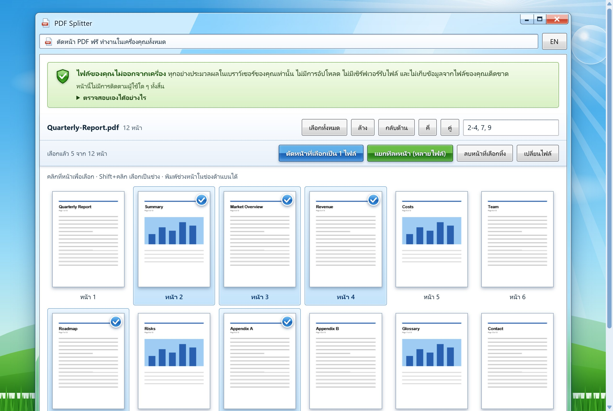
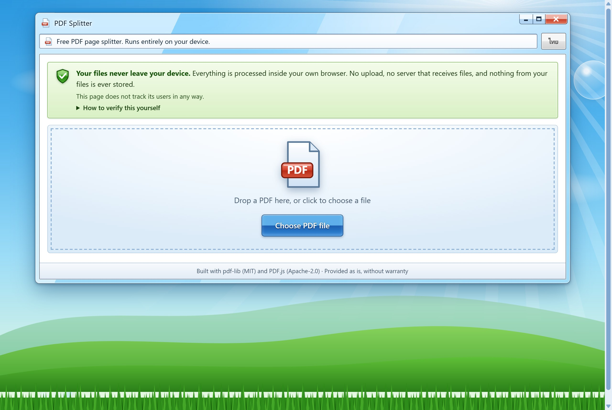
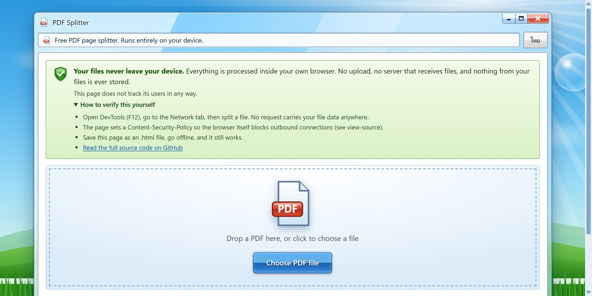
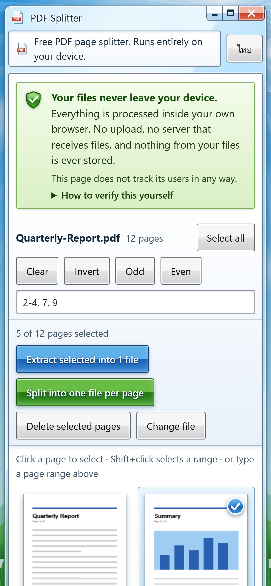

<div align="center">

# PDF Splitter

**ตัดหน้า PDF ได้ในไม่กี่วินาที ไฟล์ของคุณไม่ออกจากเครื่อง**

Cut pages out of a PDF in seconds. Your file never leaves your device.

[](https://github.com/AlungranPJ/pdf-splitter/actions/workflows/pages.yml)
[](LICENSE)


### [เปิดใช้งาน](https://alungranpj.github.io/pdf-splitter/?lang=th) &nbsp;·&nbsp; [English README](README.md)

<br>



</div>

<br>

## ทำไมถึงมีโปรเจกต์นี้

เว็บตัด PDF ฟรีส่วนใหญ่ให้อัปโหลดไฟล์ขึ้นเซิร์ฟเวอร์ ถ้าเป็นเมนูร้านอาหารก็ไม่เป็นไร แต่ถ้าเป็นสัญญา สลิปเงินเดือน หรือเอกสารการแพทย์ ไม่ควรทำแบบนั้น

PDF Splitter ทำงานทั้งหมดในแท็บเบราว์เซอร์ของคุณ ไม่มีขั้นตอนอัปโหลด เพราะไม่มีเซิร์ฟเวอร์ที่จะรับไฟล์ และหน้าเว็บตั้ง Content-Security-Policy ให้เบราว์เซอร์เองเป็นฝ่ายปฏิเสธการเชื่อมต่อออกนอกเครื่อง

## ความสามารถ

| | |
|---|---|
| **เลือกหน้าจากภาพย่อ** | คลิกภาพย่อ, `Shift`+คลิกเลือกเป็นช่วง หรือพิมพ์ `1-3, 5, 8-10` |
| **ผลลัพธ์ 3 แบบ** | ตัดหน้าที่เลือกเป็น **1 ไฟล์**, แยก **ทีละหน้า** หรือ **ลบ** หน้าที่เลือกทิ้ง |
| **ตัวช่วยเลือก** | เลือกทั้งหมด, ล้าง, กลับด้าน, หน้าคี่, หน้าคู่ |
| **ไทยและอังกฤษ** | ตรวจภาษาจากเบราว์เซอร์อัตโนมัติ สลับได้ด้วยปุ่ม หรือบังคับด้วย `?lang=th` / `?lang=en` |
| **ใช้ออฟไลน์ได้** | เป็นไฟล์ HTML ไฟล์เดียว บันทึกเก็บไว้แล้วเปิดจากเครื่องได้เลย |
| **ใช้คีย์บอร์ดได้** | ภาพย่อโฟกัสได้: `Tab` เลื่อน, `Space` หรือ `Enter` เลือก/ยกเลิก |
| **รองรับมือถือ** | จัดเลย์เอาต์สำหรับจอคอมและจอมือถือ |

## ภาพหน้าจอ

<table>
  <tr>
    <td width="50%"></td>
    <td width="50%"></td>
  </tr>
  <tr>
    <td align="center"><sub>หน้าเริ่มต้น: วางไฟล์ PDF หรือกดเลือกไฟล์</sub></td>
    <td align="center"><sub>ส่วนติดต่อผู้ใช้ภาษาไทย</sub></td>
  </tr>
  <tr>
    <td width="50%"></td>
    <td width="50%" align="center"></td>
  </tr>
  <tr>
    <td align="center"><sub>กล่องความเป็นส่วนตัวพร้อมวิธีตรวจสอบเอง</sub></td>
    <td align="center"><sub>เลย์เอาต์มือถือ (กว้าง 390 px)</sub></td>
  </tr>
</table>

> ภาพทั้งหมดถ่ายจาก build ในเครื่องที่ไม่มีตัวนับผู้เข้าชม โดยใช้ PDF ตัวอย่างที่สร้างขึ้นเอง ภาพบางภาพเป็นภาษาอังกฤษ ส่วนเว็บจริงจะมีประโยคเรื่องตัวนับเพิ่มตามที่อธิบายในหัวข้อ [ความเป็นส่วนตัว](#ความเป็นส่วนตัว)

## วิธีใช้

1. เปิด **https://alungranpj.github.io/pdf-splitter/**
2. ลากไฟล์ PDF มาวาง หรือกด **เลือกไฟล์ PDF**
3. คลิกภาพย่อเพื่อเลือกหน้า หรือพิมพ์ช่วง เช่น `2-4, 7, 9`
4. กดปุ่มใดปุ่มหนึ่งใน 3 ปุ่ม ไฟล์จะดาวน์โหลดจากเบราว์เซอร์ของคุณโดยตรง

ชื่อไฟล์ที่ได้:

| การทำงาน | ชื่อไฟล์ |
|---|---|
| ตัดหน้าที่เลือกเป็น 1 ไฟล์ | `<ชื่อเดิม>_p2-4_7_9.pdf` |
| แยกทีละหน้า | `<ชื่อเดิม>_page001.pdf`, `<ชื่อเดิม>_page002.pdf`, … |
| ลบหน้าที่เลือกทิ้ง | `<ชื่อเดิม>_removed.pdf` |

## ความเป็นส่วนตัว

- ไฟล์ PDF ถูกอ่านและเขียน **ในเบราว์เซอร์ของคุณเท่านั้น** ด้วย [pdf-lib](https://github.com/Hopding/pdf-lib) และ [PDF.js](https://github.com/mozilla/pdf.js) ที่รวมอยู่ในหน้าเว็บแล้ว ไม่มีการอัปโหลด และไม่มีเซิร์ฟเวอร์รับไฟล์
- หน้าเว็บตั้ง `Content-Security-Policy` แบบเข้มงวด: `default-src 'none'` ไม่ดึงฟอนต์ รูป หรือสคริปต์จากภายนอก เบราว์เซอร์จะบล็อกการส่งข้อมูลไปยังที่ที่ไม่ได้อนุญาต
- **ตัวนับผู้เข้าชม** เว็บจริงนับจำนวนผู้เข้าชมแบบไม่ระบุตัวตนด้วย [GoatCounter](https://www.goatcounter.com/) ไม่ใช้ cookie ไม่ได้รับชื่อไฟล์หรือเนื้อหาไฟล์ และไม่ทำงานถ้าเบราว์เซอร์ส่ง Do Not Track นี่เป็นการเชื่อมต่อเครือข่ายเพียงอย่างเดียวของหน้านี้ CSP อนุญาตแค่โฮสต์นี้โฮสต์เดียว และกล่องความเป็นส่วนตัวบนหน้าเว็บก็บอกเรื่องนี้ไว้ตรง ๆ ส่วน build ที่ไม่ตั้งตัวนับจะไม่มีโค้ดติดตามเลย

**ตรวจสอบเองได้**

1. เปิด DevTools (`F12`) → แท็บ **Network** แล้วลองตัดไฟล์ จะไม่มี request ที่พาข้อมูลไฟล์ออกไป
2. ดู view-source แล้วอ่านแท็ก `<meta>` ของ CSP
3. บันทึกหน้าเป็น `.html` ปิดอินเทอร์เน็ต แล้วใช้งาน ก็ยังทำงานได้

## Build จากซอร์สโค้ด

`index.html` สร้างขึ้นเป็นไฟล์เดียวจาก `template.html` และไลบรารีใน `vendor/` ใช้แค่ Python 3

```bash
git clone https://github.com/AlungranPJ/pdf-splitter.git
cd pdf-splitter

python build.py                       # ไม่มีโค้ดติดตามเลย
python build.py --goatcounter mysite  # นับผู้เข้าชมแบบไม่ระบุตัวตนผ่าน mysite.goatcounter.com

# จากนั้นเปิด index.html ด้วยเบราว์เซอร์ได้เลย
```

`build.py` เขียน CSP ให้ด้วย ถ้าไม่เปิดตัวนับ `connect-src` จะเป็น `'none'` ถ้าเปิด จะเพิ่มเพียง `gc.zgo.at` (สคริปต์ตัวนับ) และโฮสต์ `*.goatcounter.com` ของคุณเอง

## Deploy สำเนาของคุณเอง

workflow ที่มีมาให้ (`.github/workflows/pages.yml`) จะ build และเผยแพร่ขึ้น GitHub Pages ทุกครั้งที่ push เข้า `main`

1. Fork repo แล้วตั้ง **Settings → Pages → Source** เป็น **GitHub Actions**
2. ทางเลือก: ถ้าต้องการนับผู้เข้าชม ให้สร้างเว็บใน GoatCounter แล้วตั้ง **variable** ของ repo ชื่อ `GOATCOUNTER_CODE` เป็นรหัสของเว็บนั้น ถ้าไม่ตั้ง หน้าเว็บจะไม่มีการติดตามเลย
3. Push เข้า `main` หรือสั่งรัน workflow เอง

## ข้อจำกัดที่ทราบ

- PDF ที่ใส่รหัสผ่าน ไฟล์ขนาดใหญ่มาก (หลายร้อยหน้า) และ PDF ที่มีฟอนต์ไทยหรือรูปภาพหนัก ๆ **ยังไม่ได้ทดสอบ**
- ตรวจแล้วบน Chrome (หน้าจอคอมและ viewport มือถือ 390 px) ส่วน Edge, Firefox และ Safari ยังไม่ได้ตรวจ
- การตัดหน้าใช้การคัดลอกหน้าด้วย pdf-lib ฟีเจอร์ที่อยู่นอกโครงสร้างหน้า (เช่น ฟอร์มบางชนิด, bookmark) อาจไม่ถูกคัดลอกไปด้วย

## เครดิตและลิขสิทธิ์

สร้างด้วย [pdf-lib](https://github.com/Hopding/pdf-lib) (MIT) และ [PDF.js](https://github.com/mozilla/pdf.js) (Apache-2.0) หน้าตาได้แรงบันดาลใจจาก Windows 7 และ Frutiger Aero งานภาพทั้งหมดวาดด้วย SVG และ CSS

เผยแพร่ภายใต้ [MIT License](LICENSE) ให้ใช้ตามสภาพ ไม่มีการรับประกันใด ๆ
